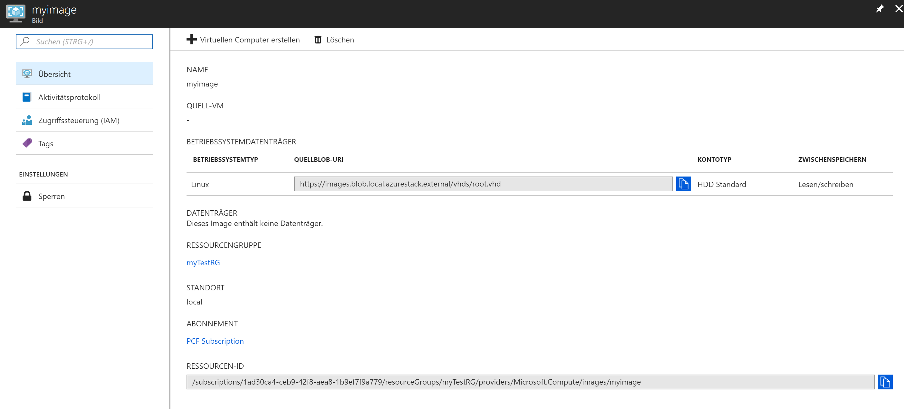
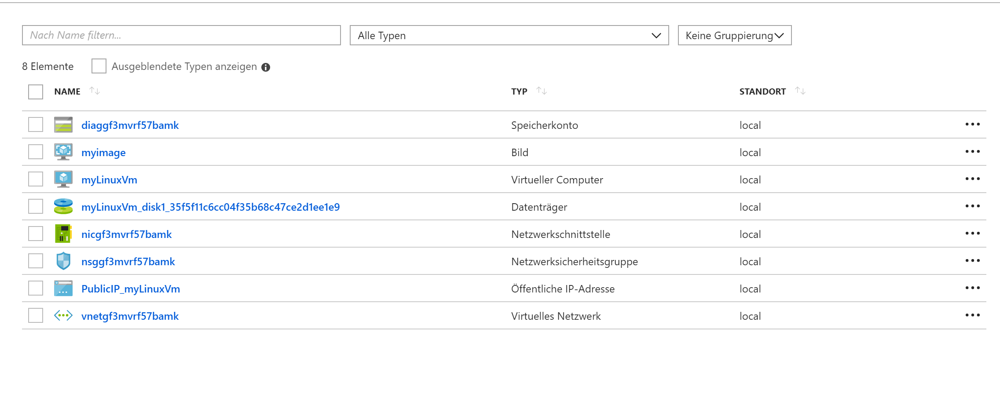
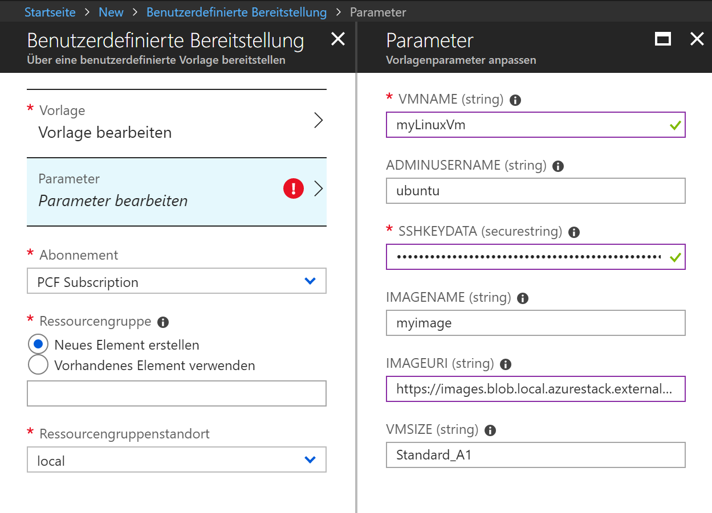

# [IaaS Linux VM using managed disk from custom image]
<a href="https://portal.local.azurestack.external/#create/Microsoft.Template/uri/https%3A%2F%2Fraw.githubusercontent.com%2FAzure%2Fazurestack-quickstart-templates%2Fmaster%2F101-simple-linux-vm-custom-managed-disk%2Fazuredeploy.json" target="_blank">

</a>
<a href="http://armviz.io/#/?load=https://raw.githubusercontent.com/Azure/azurestack-quickstart-templates/master/101-simple-linux-vm-custom-managed-disk/azuredeploy.json" target="_blank">
  
</a>

This template deploys a Linux VM from a Custom Image using Managed Disk  



`Tags: [Linux]`

| Endpoint        | Version           | Validated  |
| ------------- |:-------------:| -----:|
| Microsoft Azure Stack      | - |  yes|

## Prerequisites

AzureStack must be 1901 or greater to support Custom Images 

Prepare or Download a Customized Linux Image Template
Follow the below links to create/download a Linux Image 

1. https://azure.microsoft.com/en-us/documentation/articles/azure-stack-linux/ 
2. https://azure.microsoft.com/en-us/documentation/articles/azure-stack-add-image-pir/


## Deployment Options

for all deployments, a vhd file and a ssh public key is required.
the powershell script option reads the key from a specified sshKeyfile ( your_keyfile.pub)



1. Deploy to Azure Stack portal using custom deployment
Upload the Image to a Storage Account, with Public read Access
During Deployment, Specify the imageUri Parameter of the vhd
Deploy the Image using the Quickstart templates from Template Deployment


2. Deploy through Visual Studio
Upload the Image to a Storage Account, with Public read Access
During Deployment, Specify the imageUri Parameter of the vhd
use the azuredeploy.json and azuredeploy.parameters.json to deploy

3. Deploy the solution from PowerShell with the following PowerShell script 
Follow the below link to configure the Azure Stack environment with Add-AzureRmEnvironment cmdlet and authenticate a user to the environment
https://docs.microsoft.com/en-us/azure/azure-stack/azure-stack-powershell-configure
  
the [ExampleScript](deploy_image.ps1)  will create
- a Storage Account and Image Resource Group ( Default: image in image_rg)
- upload the Linux Image
- Deploy the vhd to Deployment resource Group

```Powershell
.\deploy_image.ps1 -sshKeyFile $HOME/key.pub -Image $HOME\Downloads\MyLinuxVM.vhd
```

4. Deploy using Az CLI
```Powershell
# update parameters values in azuredeploy.parametrs.json file and run below commands
# create resource group if it doesn't exist
az group create --name testrg --location "local"
# ARM template deployment
az deployment group create --resource-group testrg --template-file .\azuredeploy.json --parameters .\azuredeploy.parameters.json
# Bicep deployment
az deployment group create --resource-group testrg --template-file .\azuredeploy.bicep --parameters .\azuredeploy.parameters.json  
```